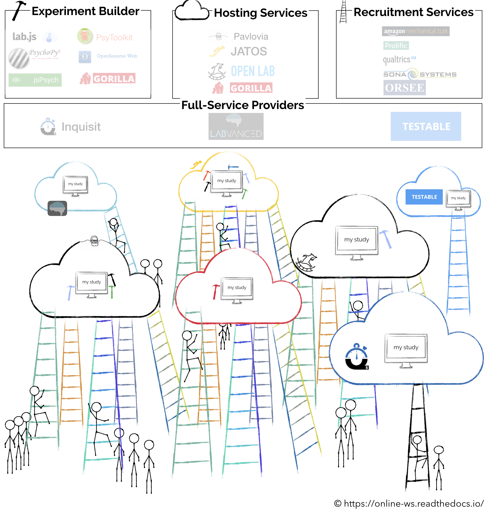
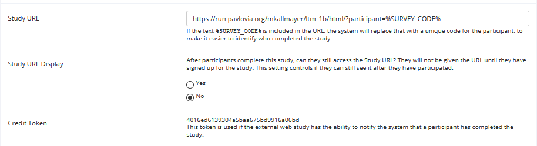
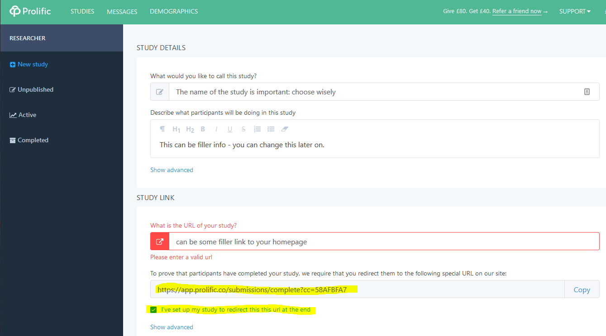
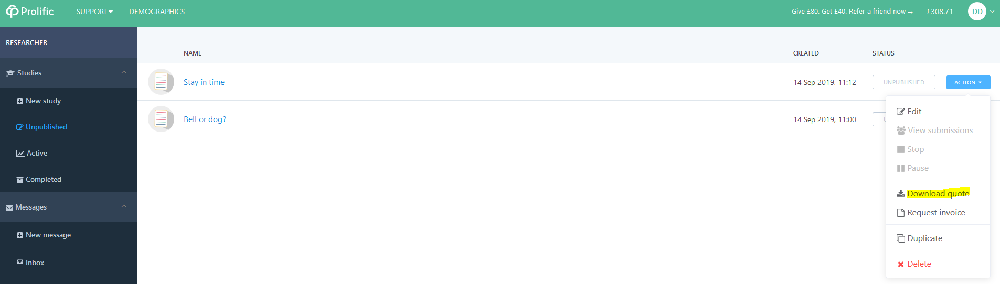
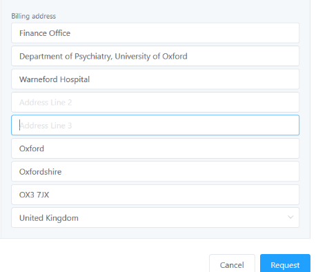

# **Chapter 1: Introduction to the ecosystem of online experimentation**
Online testing carries several advantages over in-lab experimentation. Due to the large participant number and their constant availability (different time zones), testing online is far more efficient. Further time is saved as the experimenter does not need to be physically present while the participants are completing a study. Moreover, online samples are more representative of the general population when compared to traditional undergraduate samples.

Classic worries about online testing are connected to *timing* and *data quality*. As most applications operate by downloading (pre-buffering) the entire experiment onto the participant's machine, timing issues are usually related to the system specifications of the participant's PC. Noted, most laptops operate a 60HZ monitor, thus this should be seen as the best available refresh rate. Critically, a recent [mega-study](https://psyarxiv.com/d6nu5/) has demonstrated rather favorable reliability of timings in online testing.

Concerning *data quality*, online participants will likely be very unfamiliar with classic cognitive tasks and more used to questionnaires. Thus, it is important to make the tasks exceptionally clear and to include informative practice phases. Put yourself into the shoes of somebody sitting in front of their laptop in a world of distraction. The tasks need to be as short as possible and as interesting as possible. Ideally, this should be accompanied by a good incentive (e.g. the possibility to earn more money by performing well). These strategies are necessary in order to keep the participants motivated and hold their attention. Further, while basic information about the remote system is available (e.g. screen size, refresh rate), it is of course unknown what the conditions were under which the participant conducted the study (e.g. distance to screen, lighting, distraction, etc.). While visual experiments work quite well in online studies, auditory studies are an issue as they usually require the participant to own *and use* specialized equipment (e.g. high quality headphones).

Keeping all these limitations in mind, carefully crafted and well-tested online studies have a huge potential. Many of the noise factors can be combated with a large sample size and a strong set of a priori assumptions.

By the end of the chapters in this resource, you will likely notice that, to a certain extent, creating successful online experiments is a bit similar to product (e.g. App) development - one needs to think of a coherent production framework and constantly worry about what the users are doing with the product and if they are understanding it - without a lot of opportunities for direct feedback.

**From all chapters, Chapter 1 has many examples which are very specific to the University of Oxford. This is because it covers issues like payments and ethics. The subsequent chapters are extremely general, focus more on the actual implementation of experiments and should be helpful to anyone interested in transitioning to online experimentation.**

# 1. The ecosystem of online studies
The first steps into online experimenting are not necessarily easy or intuitive. In order to navigate this terrain efficiently, we will try to outline the big picture, before we get lost in tangents and details.



## 1.1. The whole is bigger than the sum of its parts
Coming from a traditional offline-testing world, we usually have a very segregated view on the summation of processes that ultimately result in data files on our hard drive. We like to think about **(1)** programming an experiment in our favorite software (PsychoPy, PsychToolbox, E-prime, etc.) as quite independent of the **(2)** location/lab in which we will conduct the study, and **(3)** the way we recruit the participants, e.g. fliers, online sign-up systems, etc. This strong separation is inherently preserved in online studies, however more consideration is required if we want these 3 essential steps to maintain a symbiotic relationship. We again need to **program a study** (see ```1.2.```), now however, in a language that is browser-friendly. Then, we will need to **host that study** (see ```1.3.```) somewhere, that is, find a provider which makes the study accessible online to everybody who has a link to it. And that provider/host needs to be compatible with the format of the study we programmed. Finally, we need to **recruit participants** (see ```1.4.```) who will complete the study and this should ideally also happen online (but there are also benefits of using online studies for in-lab experimentation, see ```1.4.4.```). Thus, the conceptual pipeline of creating online experiments is equivalent to offline practices, but requires a bit more thought to achieve compatibility between the different effectors.

## 1.2. Programming the experiment
This workshop is based on an implementation of online studies via the [PsychoPy](https://psychopy.org/) + [Pavlovia](https://pavlovia.org/docs/home/about) ecosystem. There is a multitude of reasons why we think this is one of the most promising and future-proof alternatives for embarking on the online journey. First, PsychoPy is a stand-alone experimental programming environment which has been developed for many years. So the skill of learning it is as transferable as it gets - beyond online experiments, it empowers a powerful and timing-precise experimental generation for psychophysics, eye-tracking, E/MEG, fMRI, etc.
PsychoPy has an easy to learn GUI for drag-and-drop creation of tasks. But it is also expandable with powerful Python-code inserts, whenever a higher complexity is required. As it is Python-based, it is again extremely transferable - requiring learning a language which is science- and industry-relevant beyond mere experimental programming. Further, as it is a very popular open source and community-driven software, you will find a very friendly and responsive [forum](https://discourse.psychopy.org/) in case you are ever looking for help. Finally, the development team around Jon Peirce is extremely dedicated to the software and after some successful funding rounds, it seems like in the foreseeable future there will be full-time employees working on the software, instead of this being a late night side job - which for open-source projects is MASSIVE. So we will keep on seeing exciting developments instead of simple maintenance of already existing features.

### 1.2.1. Install PsychoPy
In case you aim at following the subsequent chapters, please [download AND install PsychoPy](https://www.psychopy.org/download.html). While you are at it, you should probably also sign up for the [PsychoPy forum](https://discourse.psychopy.org/). You will find a lot of relevant questions there and the threshold for asking is quite low - it's not even remotely as scary as many of the other online help communities (e.g. StackOverflow - one of us is still traumatized after putting a question on there... there is just so much an ego can take).

### 1.2.2. Create your first experiment in PsychoPy
A great way to get your feet wet, is to complete this [15min video tutorial](https://www.youtube.com/watch?v=VV6qhuQgsiI). Please build the Stroop task presented in this video. We will use this task in the next chapter.

### 1.2.3. Alternatives
Here we focus on PsychoPy, but this of course is not the only way to create experiments which could be made online-compatible. Popular other alternatives are [OpenSesame](https://osdoc.cogsci.nl/3.2/manual/osweb/), [jsPsych](https://www.jspsych.org/tutorials/hello-world/), [Gorilla](https://gorilla.sc/), [lab.js](https://labjs.readthedocs.io/en/latest/), [PCIbex](https://www.pcibex.net/documentation/), etc. You can find a quite comprehensive list of alternatives [here](https://online-ws.readthedocs.io/en/latest/#a-short-introductory-read).

## 1.3. Hosting the study
How will participants reach the study once we have programmed it? Again, there are many ways in which to do this. People who know what they are doing usually prefer to run studies from their own server (or cloud services such as [AWS](https://aws.amazon.com/)). This allows for full control over the environment, but comes with the downside of a rather steep "how-to-deal-with-servers" learning curve. Further, it seems that it is not a very sustainable way of enabling many people to run studies online - usually people who set these servers up leave after a few years and their product becomes outdated and is simply not used anymore.

By all means, if you feel like setting up and running your study from your own or a university server - do it (we recommend [JATOS](https://www.jatos.org/Get-started.html) which you can set up with the help of [MSD IT](https://www.medsci.ox.ac.uk/divisional-services/support-services-1/information-technology) in case you are in Oxford).

The rest of us will have to select a provider which handles all the nitty gritty mechanics. The downside is that this is never a free service - we will have to pay the provider to host our studies. Oxford affiliates we have several options (licenses are paid for): [Gorilla](https://gorilla.sc/), [Testable](https://www.testable.org/) (so far only for 2020) and the one we will use in the following chapters -> [Pavlovia](https://pavlovia.org/docs/home/about) (all ```ox.ac.uk``` emails have a full license for Pavlovia).

Pavlovia is nothing short of incredible (you will notice that we get emotional quite easily), even more so when considering that is completely born out of a university lab.

* The unlimited license is [quite cheap](https://pavlovia.org/docs/store/pricing) for universities.

* All money goes into development and salaries.

* You can [share and download experiments](https://pavlovia.org/explore).

* Experimental generation is managed by a GitLab version control environment.

* It interacts well with participant recruitment systems (e.g. SONA, [Testable Minds](https://minds.testable.org/), Mturk or Prolific).

* It can host experiments created in PsychoPy, jsPsych, or lab.js.

### 1.3.1. Create a Pavlovia account
In case you aim at following the subsequent chapters, please register for a [Pavlovia](https://pavlovia.org/) account. You should use your ```ox.ac.uk``` email address in order to get access to the *unlimited license*.

## 1.4. Recruiting participants
After creating your study and finding an appropriate hosting service for it, you get a link (URL) which will lead participants to your experiment. You can manually share your link or use an *online marketplace*, where participants can  view  and  sign  up  for  experiments by following the link to the experiment server. Examples  of  such  marketplaces  are  [SONA](https://www.sona-systems.com/default.aspx), [Prolific](https://www.prolific.co/), [Testable Minds](https://minds.testable.org/) or [Amazon Mechanical Turk](https://www.mturk.com/). Online experiments often display a unique code that participants can enter in the recruitment system so the experimenter can verify their participation. Sometimes this is handled automatically.

**Make sure all data quality checks are in place before you start mass-testing.**

**A good pipeline in our opinion:**

* **1.** Pilot a few people that you know by just manually sharing the link: interview, analyze and fix errors.

* **2.** Pilot 10 people from SONA - because you have a better idea about that specific population and it is equivalent to the population you use for in-lab testing.

* **3.** After fixing all issues and analyzing the pilot data from these “safer” avenues (1 and 2), you can start testing your study on SONA, Prolific, Mturk or whatever other recruiting platform you have chosen. Probably good to test in batches - e.g. if you want to test 100 participants, test in 3 batches of 33 people - so you can make sure everything is going fine in reasonable intervals and resources don't go to waste.

### 1.4.1. Manually share link
 You could essentially start sharing the study-link directly with participants. Albeit very inefficient and error-prone on a mass-scale (as it also requires dealing with monetary compensation manually), this is actually a great way to pilot your online study once it is ready (see **1.** above).

### 1.4.2. In-house recruiting system (e.g. SONA)
Advertising and recruiting for a study via [SONA Experimental Psychology](https://opr.sona-systems.com) or the in-house recruiting system of your university, is extremely similar to the way you do it for in-lab studies. We will give a quick step-by-step example using SONA.

1) After *creating a* | *logging in with* your Researcher account, you can ```Add New Study```.


2) Critically, you need to add the link to your study in the **Study URL** section. As SONA instructs, you have to append ```participant=%SURVEY_CODE%``` to your link. This will create a SONA specific participant ID, which is critical for compensation, as it allows matching the data file with the participant who completed the task.


3) Ideally, the description of your task in SONA is quite informative - mainly when it comes to money. This prevents a lot of unnecessary back-and-forth email between you and your participants.

A brief example:

```
Click the Complete Survey Now button after signing up for a time slot.
It will take you to an experiment which will open in a full-screen window.
Please do not exit this window until you complete the experiment.
You can ONLY complete this experiment by using Mozilla Firefox or Chrome as a browser.
Safari and Edge are not allowed.
The experiment is quite fun, lasts approx. 20 min and you will receive 3 pounds for it.
You will be contacted via email (available to us via SONA) about providing us with
your payment information a few days after you participated.
It can take up to 3 weeks for the payment to be processed.
```

4) Creating timeslots is a bit different for online studies. Instead of a classic "slot", you create a *deadline*. You can select the amount of people you want to test and then participants can sign up for it in the same way they would sign up for in-lab studies. In this case, *signing up* does not equal *participating*. Participants are free to participate in the study UNTIL the deadline, thus it can happen that somebody signs up, but will not complete the study for a week (depending on the deadline).


#### 1.4.2.1 Paying for studies via SONA (specific to Oxford)
SONA is a solid place to advertise and recruit, however it scales poorly. There are not too many participants in the system to begin with and paying participants is quite cumbersome. So we can recommend it with manageable sample sizes (<30 participants), but it is a huge time sink for big sample sizes.

For a more comprehensive description of payments in Oxford, have a look [here](https://unioxfordnexus.sharepoint.com/:f:/s/ClinicalNeurosciences-OHBAOnlineExperiments/Eou5eA5Ro-5OgoBZSYHJZ2UBH9FarE6lxP7DkmZPbKJKrA?e=xQzXxm).

1.	Once you have created your SONA online study and added your study link to it, you can set time slots and number of participants just like with regular studies. You pay participants after they have participated.
2.	Participants will sign up and complete your study. Try to time your testing slots well so that you can test at least 10 participants in a week. Testing  more than 9 participants allows you to use the bulk testing form of the **Experimental Psychology Department** or the **Department of Psychiatry**. Find the forms and more information [here](https://unioxfordnexus.sharepoint.com/:f:/s/ClinicalNeurosciences-OHBAOnlineExperiments/Eou5eA5Ro-5OgoBZSYHJZ2UBH9FarE6lxP7DkmZPbKJKrA?e=xQzXxm).
Try not to let too much time pass until you have collected 10 participants, so that the *first* participant doesn’t have to wait too long for their payment – this creates unnecessary and time-consuming email queries.
3.	In order to get the participants' payment information, you will need to contact them manually (we know – quite time-consuming and not great for big studies; almost as depressing as the life of one of the authors - a self-defined color-blind synesthete). The easiest way to contact participants is to ```Download the SONA Participant List``` as a .csv file and copy all the email addresses from it. This option is available via the ```Study Menu``` of your study.
4.	The most time efficient method is to let participants fill out a simplified [blank form](https://unioxfordnexus.sharepoint.com/:f:/s/ClinicalNeurosciences-OHBAOnlineExperiments/Eou5eA5Ro-5OgoBZSYHJZ2UBH9FarE6lxP7DkmZPbKJKrA?e=xQzXxm) themselves and send it back to you. You can then collate all the forms and just copy-paste them into one form. Save the form using the study name followed by the date period it covers. Password protect the final form and send it to your Lab Manager, followed by the password in a separate email.

*Note: In the study description (and when you are contacting participants), please keep participants well-informed about the duration (usually 3 weeks) and the overall process of the reimbursement. This spares everybody a lot of unnecessary email traffic.*


### 1.4.3. Prolific (quite specific to Oxford)
In the following chapters we will be using Prolific for recruitment. Please register for a [Prolific](https://www.prolific.co/) account. You should use your ```ox.ac.uk``` email address.

The best way to navigate Prolific is to go through the many tutorials and examples it provides. This is also the best way [to create your first study](https://researcher-help.prolific.co/hc/en-gb/articles/360009220953-Creating-a-study-on-Prolific). The good thing is that while you have *no* money on your Prolific account, there is little you can mess up incidentally, e.g. you can't release a study to thousands of participants without money. So really take the time to explore it. For example, the option to specify how many participants are needed, fair payment, and how to set additional screening criteria. You will find all these topics in the [documentation](https://researcher-help.prolific.co/hc/en-gb).

### 1.4.3.1. Create a Prolific study
In the following chapters we will advertise our study via Prolific, thus we will go through one example specifically. But in case you have not created any studies in Prolific yet, now is the time to try it out.

1. After creating an account, add a VAT number via the ACCOUNT tab of Prolific. The universal Oxford University VAT number is ```GB125506730```. This will make payment claims much easier in the future.

2. Next, you need to create/add a new study on Prolific.  Give the study a meaningful name - this is important as you will use it to claim participant money from the financial department of Experimental Psychology or Psychiatry. For the rest you can add placeholder information/links – these you can change at any time in the future. These fields are irrelevant at this stage.


3. Note the two fields marked in yellow. The first one shows the study link. You will insert this link into your PsychoPy experiments. It redirects the participants back to Prolific when they are done with the experiment. This is how Prolific knows who finished the task and how long it took them.

4. When you create a new study, you need to enter **(1)** how many participants you want to recruit, and **(2)** the amount you want to reward to each participant as stated in your [ethics](https://online-ws.readthedocs.io/en/latest/Ch_1_GettingStarted/#2-ethics).


5. Save the study **as a draft**.

**In case you want to follow the subsequent chapters beat by beat, please make sure that you somehow have a bit of money on your prolific account.**

#### 1.4.3.2. Paying for studies via Prolific
For a more comprehensive description of payments in Prolific, have a look [here](https://unioxfordnexus.sharepoint.com/:f:/s/ClinicalNeurosciences-OHBAOnlineExperiments/Eou5eA5Ro-5OgoBZSYHJZ2UBH9FarE6lxP7DkmZPbKJKrA?e=xQzXxm).

1. From the ```Action menu``` of the study (draft), you need to ```Download quote``` and ```Request Invoice```.


2. You need to set the appropriate billing address when requesting an invoice. The address should be the address of your department (department of the grant): for EP that is ```Experimental Psychology Finance Office, University of Oxford, Anna Watts building, Radcliffe Observatory Quarter, Woodstock Road, Oxford, OX2 6GG```; for Psychiatry: ```Department of Psychiatry Finance Office, University of Oxford, Warneford, Hospital, Oxford, OX3 7JX```.


3. You can now send the generated **PDF quote** + **Requested Invoice (email or PDF)** + **the grant number/information** that pays for the study to your Lab Manager who will raise a PO for it. Expect the requested amount to be added to your Prolific account in about 2 weeks.

    *Note: The quote you generated is study-specific – so one quote = one study. In case you want money for multiple studies, you need to create them in Prolific and follow the steps above in order to get quotes for each one separately. This means that you need to decide on the number of participants you want to test per study before you actually run it.*

4. Once you have collected all participants for a study you should send the Lab Manager a summary of the costs and participants. This is quite easy. Just go to your ```Completed studies``` and download the ```Detailed summary```.


5. *Refunds: In case you did not use all the money on your Prolific account, please make sure to request a refund of that money as described [here](https://researcher-help.prolific.co/hc/en-gb/articles/360009092434-Refunds). Contact your Lab Manager briefly before you do that.*


### 1.4.4. Benefits of using online studies for in-lab experimentation
In certain circumstances, coding and hosting your study online can also be a viable option for conducting in-lab experiments. It requires very little prerequisites from the hosting lab computer - a functioning browser and an active internet connection. This can be extremely efficient for testing multiple subjects at once, at so-called "multi-testing" facilities. Further, it allows for flexible testing in unknown environments - e.g. testing in schools or in the lab of a collaborator. Finally, conducting experiments this way has the benefit of a centralized location of data storage, that is the *server* (see ```1.3.```). So irrespective of the different testing locations, the data always ends up in the same spot and is immediately accessible to the researcher.

## 1.5. Data
After each participant completes the study, the data is saved on the server of the respective host (see ```1.3.```). In the case of Pavlovia, simply syncing  the experimental folder will download the latest data files on your local machine. This can also be done manually on the GitLab page of the study (e.g. the ```data``` folder [here](https://gitlab.pavlovia.org/demos/stroop/tree/master)), but more about this will be covered in the subsequent chapters.

Importantly, make sure that the servers hosting the data are [GDPR compliant](https://pavlovia.org/docs/home/ethics).

# 2. Ethics
Even though we cover ethical approval last here, it is usually the first thing you need to get when you want to start experimenting.

Thanks to the amazing [expertise](https://unioxfordnexus.sharepoint.com/:f:/s/ClinicalNeurosciences-OHBAOnlineExperiments/En4FGfw7n-xCmPNXx1L4h_gB7iz3jwwcjRBXecBAlnTdaQ?e=vKTHW7) in the Department, we have collated several [examples of successful applications for ethical approval](https://unioxfordnexus.sharepoint.com/:f:/s/ClinicalNeurosciences-OHBAOnlineExperiments/EsU1oM6UwrlBhkrTKEBi1doB36byS5MdDjBsL_v1i6R-KA?e=yJ3Kql).
