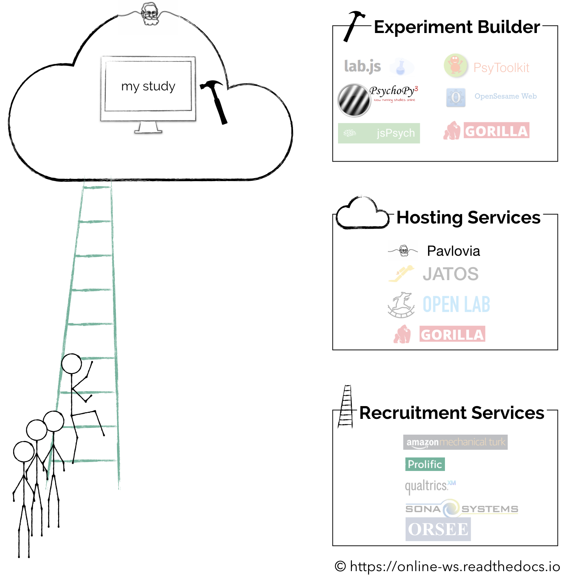

 Introduction to Online Experiments  
--------

Welcome to **Introduction to Online Experiments**, prepared by the [Brain & Cognition Lab](http://www.brainandcognition.org/). In this resource, we collate important information about online testing, and provide step-by-step guides for a successful transition to online experimentation.

The content in this resource is of general relevance, but the specific examples in Chapter 1 are strongly tailored to the [University of Oxford](http://www.ox.ac.uk/), specifically the Departments of [Experimental Psychology](https://www.psy.ox.ac.uk/) and [Psychiatry](https://www.psych.ox.ac.uk/). If you are a member of these Departments, you can follow the steps essentially beat by beat (and also [find people with relevant expertise](https://unioxfordnexus.sharepoint.com/:f:/s/ClinicalNeurosciences-OHBAOnlineExperiments/En4FGfw7n-xCmPNXx1L4h_gB7iz3jwwcjRBXecBAlnTdaQ?e=vKTHW7)). If you are a visitor from a different department, university or country, you will sometimes need to find solutions which are a bit more specific to your current environment. However, the specific example cases are quite rare in our resource and usually pertain to some form of administrative task (mostly Chapter 1). Thus, the majority of the content here should be of relevance to anybody interested in embarking on the road to online experimentation.

### Various upcoming workshops/conferences (that we know about)
*recording*: [https://www.osa.org/en-us/meetings/webinar/2020/august/osa_technical_group_special_webinar_display_calibr/](https://www.osa.org/en-us/meetings/webinar/2020/august/osa_technical_group_special_webinar_display_calibr/)

*June 30th*: [https://pushkin-consortium.github.io/movingresearchonline/](https://pushkin-consortium.github.io/movingresearchonline/)

*June 30th*: [https://twitter.com/GorillaPsyc/status/1262664234695036928](https://twitter.com/GorillaPsyc/status/1262664234695036928)

*Sep 2020*: [https://twitter.com/psychopy/status/1265315005236314117](https://twitter.com/psychopy/status/1265315005236314117)

# What do I need to know before getting started?
This [landing](https://online-ws.readthedocs.io/en/latest/) page, as well as [Chapter 1](https://online-ws.readthedocs.io/en/latest/Ch_1_GettingStarted/) cover most of the basics necessary to feel comfortable with the *nomenclature of* and *concepts in* online experimentation. This includes:

* [Programming the experiment](https://online-ws.readthedocs.io/en/latest/Ch_1_GettingStarted/#12-programming-the-experiment)

* [Hosting your study](https://online-ws.readthedocs.io/en/latest/Ch_1_GettingStarted/#13-hosting-the-study)

* [Recruiting participants](https://online-ws.readthedocs.io/en/latest/Ch_1_GettingStarted/#14-recruiting-participants)

* [Collecting data files](https://online-ws.readthedocs.io/en/latest/Ch_1_GettingStarted/#15-data)

* [Getting ethical approval](https://online-ws.readthedocs.io/en/latest/Ch_1_GettingStarted/#2-ethics)

When getting started, you will see that all these individual parts are associated with different service providers and software, which can become a bit confusing.

We hope that [this figure](https://online-ws.readthedocs.io/en/latest/Ch_1_GettingStarted/#1-the-ecosystem-of-online-studies) as well as [the paper below](https://online-ws.readthedocs.io/en/latest/#a-short-introductory-read) guide you through the online jungle a bit.

Currently, the practical emphasis (Chapters 2 & 3) of our resource is focused on implementing online studies within the [PsychoPy](https://psychopy.org/)/[Pavlovia](https://pavlovia.org/docs/home/about) ecosystem. With recruitment being performed in [SONA](https://opr.sona-systems.com) and [Prolific](https://www.prolific.co/); and ethical approval being obtained from [MS IDREC](https://researchsupport.admin.ox.ac.uk/governance/ethics/committees/msidrec). We aim at gradually covering alternative options, but the emphasis on this ecosystem will likely not change. If you are from University of Oxford's Department of Psychology, you also have access to [Qualtrics](https://oxfordxpsy.az1.qualtrics.com/) - an online platform for creating surveys/questionnaires; [Gorilla](https://gorilla.sc/) - another online platform for building customisable experiments and [SONA](https://psy-oxford.sona-systems.com/) - a platform for advertising studies and recruiting participants, which integrates closely with Gorilla, Pavlovia, and Qualtrics. 

# A short introductory read and talk
Before embarking on the chapters in this resource, we recommend reading this [short introductory paper](https://www.mdpi.com/2076-3425/10/4/251) ([Sauter, Draschkow, & Mack, 2020](https://www.mdpi.com/2076-3425/10/4/251)). We hope that this will provide a brief overview of basic concepts, as well as outline the different software solutions available to researchers.

You can also have a look at [our talk](https://www.osa.org/en-us/meetings/webinar/2020/august/osa_technical_group_special_webinar_display_calibr/) which summarizes some of these resources. The entire webinar is very interesting and our talk starts at 31min and 30sec.

<!DOCTYPE html>
<html>
    <body>
        <iframe src="https://docs.google.com/gview?url=https://www.mdpi.com/2076-3425/10/4/251/pdf&embedded=true"
        style="width: 90%; height: 1000px">
            
Your browser does not support iframes.

        </iframe>
    </body>
</html>

--------

# Contributors

Melvin Kallmayer | Leila Zacharias | Amy Gillespie | Paula Kaanders | Dejan Draschkow

**Citations**:

Kallmayer, M., Zacharias, L., Nobre, A.C., & Draschkow, D. (2020). Introduction to Online Experiments. [https://doi.org/10.17605/OSF.IO/XFWHB](https://doi.org/10.17605/OSF.IO/XFWHB)

Sauter, M., Draschkow, D., & Mack, W. (2020). Building, Hosting and Recruiting: A Brief Introduction to Running Behavioral Experiments Online. *Brain Sciences*, Vol. 10, Page 251, 10(4), 251. [https://doi.org/10.3390/BRAINSCI10040251](https://doi.org/10.3390/BRAINSCI10040251)

--------
Please let us know in case you want to contribute, on the [GitHub repository which supports this website](https://github.com/mkallmayer/online_ws/tree/master/docs).
